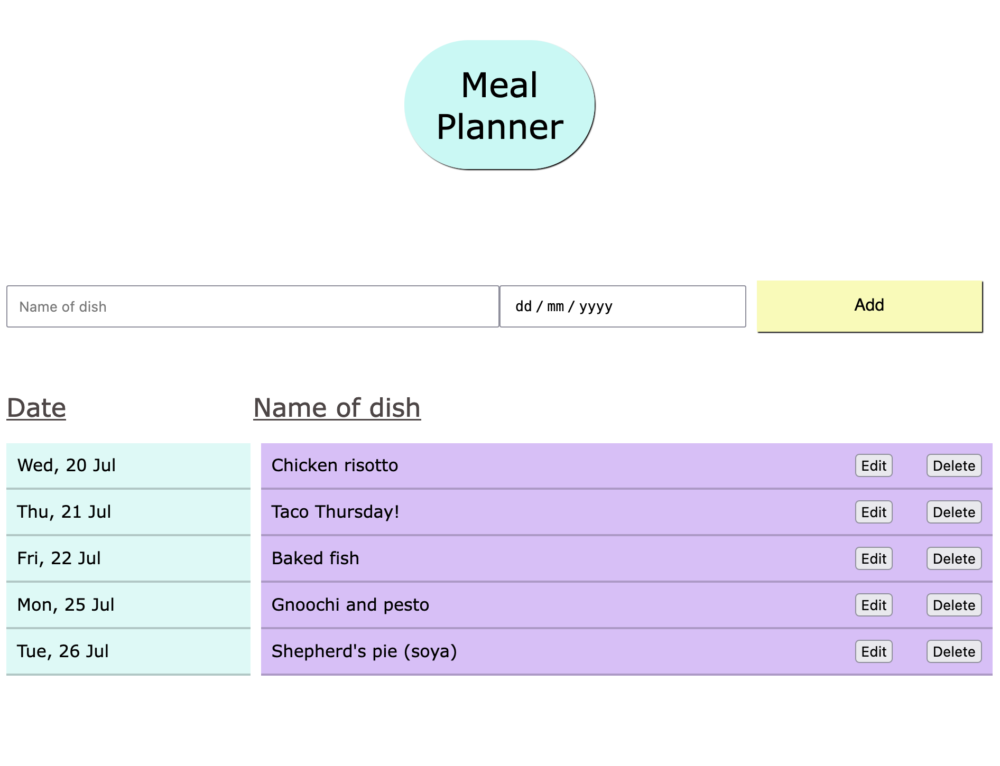

# Family Meal Planner project

To improve my vanilla JavaScript skills, I am developing a meal tracker webapp for my family to use.

## Things it can do:

- This version uses local storage in the browser to store the meal information.
- Add a dish on a given date.
- Edit a dish.
- Remove a dish from the list.

## Roadmap / to do:

- Improve editing experience to reorder list if dates change.
- Add a library of meals with to power an auto-complete on the main input.
- Suggest meals based on least recently cooked dishes.
- Store data remotely so that it can be accessed by multiple devices.
